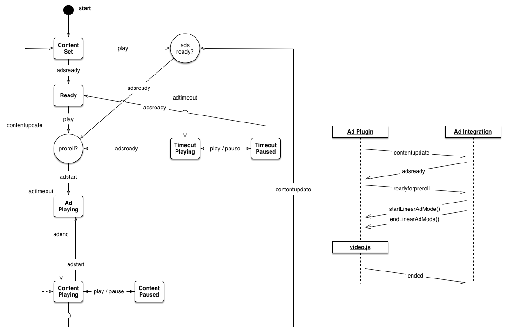

# videojs-contrib-ads [](https://travis-ci.org/videojs/videojs-contrib-ads)


The `videojs-contrib-ads` plugin provides common functionality needed by video advertisement libraries working with [video.js.](http://www.videojs.com/)
It takes care of a number of concerns for you, reducing the code you have to write for your ad integration.

## Getting Started

In addition to the video.js library, you'll need two files from this project: `videojs.ads.js` and `videojs.ads.css`.
Both are in the `src/` directory.

For development, include the CSS in your HTML's `<head>` section with a `<link>` tag:

```html
<link rel="stylesheet" href="videojs.ads.css">
```

Then, include the JavaScript file after video.js, but before your integration code:

```html
<video id="video" src="movie.mp4" controls></video>
<script src="video.js"></script>
<script src="videojs.ads.js"></script>
<script>
videojs('video', {}, function() {
  var player = this;
  player.ads(); // initialize the ad framework
  // your custom ad integration code
});
</script>
```

With this basic structure in place, you're ready to develop an ad integration.

## Developing an Integration

Once you call `player.ads()` to initialize the plugin, it provides five interaction points (three events and two methods) which you should use in your integration.

Here are the events that communicate information to your integration from the ads plugin:

 * `contentupdate` (EVENT) — Fires when a new content video has been assigned to the player, so your integration can update its ad inventory. _NOTE: This will NOT fire while your ad integration is playing a linear Ad._
 * `readyforpreroll` (EVENT) — Fires the when a content video is about to play for the first time, so your integration can indicate that it wants to play a preroll.

And here are the interaction points you use to send information to the ads plugin:

 * `adsready` (EVENT) — Trigger this event after to signal that your integration is ready to play ads.
 * `ads.startLinearAdMode()` (METHOD) — Call this method to signal that your integration is about to play a linear ad.
 * `ads.endLinearAdMode()` (METHOD) — Call this method to signal that your integration is finished playing linear ads, ready for content video to resume.

In addition, video.js provides a number of events and APIs that might be useful to you.
For example, the `ended` event signals that the content video has played to completion.

## Single Preroll Example

Here's an outline of what a basic ad integration might look like.
It only plays a single preroll ad before each content video, but does demonstrate the interaction points offered by the ads plugin.

This is not actually a runnable example, as it needs more information as specified in the code comments.

```js
videojs('video', {}, function() {
  
  var player = this;
  player.ads(); // initialize the ad framework
  
  // request ads whenever there's new video content
  player.on('contentupdate', function(){
    // fetch ad inventory asynchronously, then ...
    player.trigger('adsready');
  });
  
  player.on('readyforpreroll', function() {
    player.ads.startLinearAdMode();
    // play your linear ad content
    player.src('http://url/to/your/ad.content');
    player.one('durationchange', function(){
      player.play();
    });
    // when all your linear ads have finished...
    player.one('ended', function() {
      player.ads.endLinearAdMode();
    });
  });
  
});
```

Your actual integration will be significantly more complex.
To implement midroll ads, you'd want to listen to `timeupdate` events to monitor the progress of the content video's playback.

For a more involved example that plays both prerolls and midrolls, see the [example directory](example) in this project.

## State Diagram

To manage communication between your ad integration and the video.js player, the ads plugin goes through a number of states.
Here's a state diagram which shows the states of the ads plugin and how it transitions between them:



The ads plugin starts in the `init` state and immediately transitions to `content-set` if a video is loaded.
Transitions with solid arrows are traversed when an event with the appropriate type is triggered on the player.
Dotted-line arrows indicate a transition that occurs when a timeout expires.
The timeline at right shows how the ads plugin communicates with your integration.

## Plugin Options

The ad framework can be configured with custom settings by providing a settings object at initialization:

```js
player.ads({
  timeout: 3000
});
```

The current set of options are described in detail below.

### timeout

Type: `number`
Default Value: 5000

The maximum amount of time to wait for an ad implementation to initialize before playback, in milliseconds.
If the viewer has requested playback and the ad implementation does not fire `adsready` before this timeout expires, the content video will begin playback.
It's still possible for an ad implementation to play ads after this waiting period has finished but video playback will already be in progress.

Once the ad plugin starts waiting for the `adsready` event, one of these things will happen:

 * integration ready within the timeout — this is the best case, preroll(s) will play without the user seeing any content video first.
 * integration ready, but after timeout has expired — preroll(s) still play, but the user will see a bit of content video.
 * integration never becomes ready — content video starts playing after timeout.

This timeout is necessary to ensure a good viewer experience in cases where the ad implementation suffers an unexpected or irreparable error and never fires an `adsready` event.
Without this timeout, the ads plugin would wait forever, and neither the content video nor ads would ever play.

If the ad implementation takes a long time to initialize and this timeout is too short, then the content video will beging playing before the first preroll opportunity.
This has the jarring effect that the viewer would see a little content before the preroll cuts in.

During development, we found that five seconds seemed to be long enough to accomodate slow initialization in most cases, but still short enough that failures to initialize didn't look like failures of the player or content video.

### prerollTimeout

Type: `number`
Default Value: 100

The maximum amount of time to wait for an ad implementation to initiate a preroll, in milliseconds.
If `readyforpreroll` has been fired and the ad implementation does not call `startLinearAdMode()` before `prerollTimeout` expires, the content video will begin playback.
`prerollTimeout` is cumulative with the standard timeout parameter.

Once the ad plugin fires `readyforpreroll`, one of these things will happen:

 * `startLinearAdMode()` called within the timeout — preroll(s) will play without the user seeing any content video first.
 * `startLinearAdMode()` is never called — content video plays without preroll(s).
 * `startLinearAdMode()` is called, but after the prerollTimeout expried — bad user experience; content video plays a bit, then preroll(s) cut in.

The prerollTimout should be as short as possible so that the viewer does not have to wait unnecessarily if no preroll is scheduled for a video.
Make this longer if your ad integration needs a long time to decide whether it has preroll inventory to play or not.
Ideally, your ad integration should already know if it wants to play a preroll before the `readyforpreroll` event.

### debug

Type: `boolean`
Default Value: false

If debug is set to true, the ads plugin will output additional information about its current state during playback.
This can be handy for diagnosing issues or unexpected behavior in an ad integration.

## Building

You can use the `videojs.ads.js` file as it is in the `src/` directory, or you can use a minified version.

The ads plugin is designed to be built with `npm` and `grunt`.

If you don't already have `npm`, then download and install [Node.js](http://nodejs.org/) (which comes with npm).
Then you can install the build tool [grunt](http://gruntjs.com/):

```sh
$ npm install -g grunt
```

With grunt ready, you can download the ads plugin's build-time dependencies and then build the ads plugin.
Open a terminal to the directory where you've cloned this repository, then:

```sh
$ npm install
$ grunt
```

grunt will run a suite of unit tests and code formatting checks, then create a `dist/` directory.
Inside you'll find the minified ads plugin file `videojs-ads.min.js`.

## Release History

A short list of features, fixes and changes for each release.

### v0.2.0

 * Upgrade to video.js 4.4.3
 * Added support for burned-in or out-of-band linear ad playback
 * Debug mode

### v0.1.0

 * Initial release.

## License

See [LICENSE-APACHE2](LICENSE-APACHE2).
