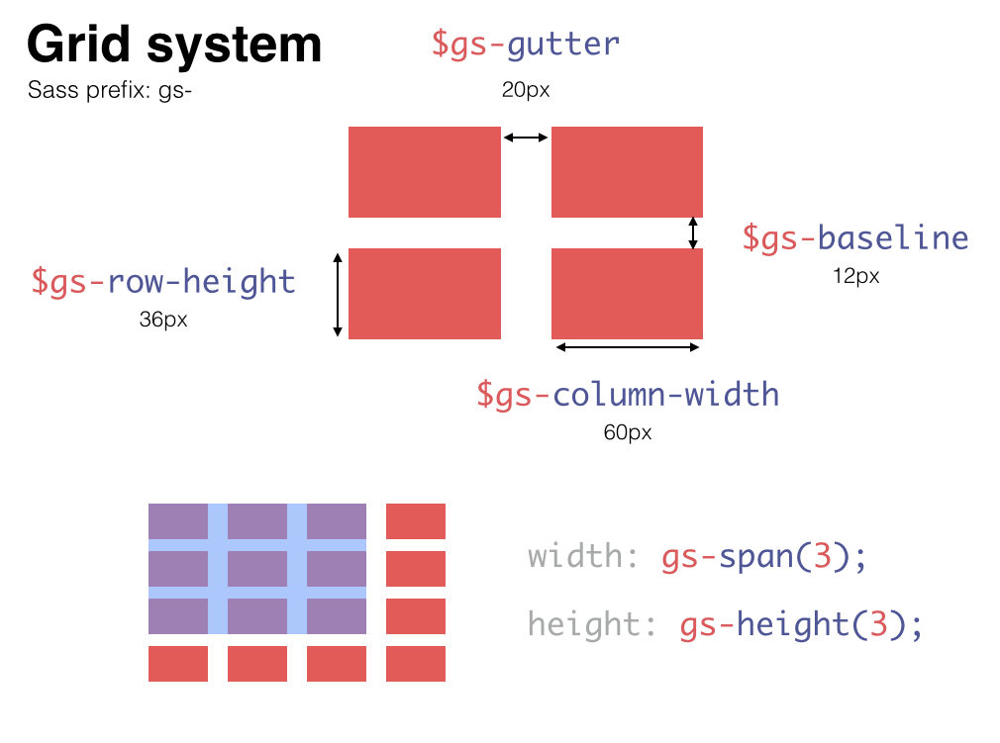

# Guss Grid System

Part of the [Guss](https://github.com/guardian/guss) collection.

## Installation

```
bower install guss-grid-system --save
```

```scss
@import 'path/to/_grid-system.scss';
```


## Features

Provides Sass mixins and values for the Guardian grid system.

### Variables and helpers



### Grid playground

http://sassmeister.com/gist/29316bef331ab0b1d551


## Example

```scss
.element {
    width: gs-span(3);
    height: gs-height(4);
    padding-top: $gs-baseline; // Use baselines for vertical spacing
    margin-left: $gs-gutter;   // Use gutters for horizontal spacing
}
.custom-wrapper {
    @include gs-container;
}
```


## Grid units reference

```scss
the-grid {
  gutter: 20px;
  baseline: 12px;

  /**
   * Columns
   */
  1-column: 60px;
  2-columns: 140px;
  3-columns: 220px;
  4-columns: 300px;
  5-columns: 380px;
  6-columns: 460px;
  7-columns: 540px;
  8-columns: 620px;
  9-columns: 700px;
  10-columns: 780px;
  11-columns: 860px;
  12-columns: 940px;
  13-columns: 1020px;
  14-columns: 1100px;
  15-columns: 1180px;
  16-columns: 1260px;

  /**
   * Rows
   */
  1-row: 36px;
  2-rows: 84px;
  3-rows: 132px;
  4-rows: 180px;
  5-rows: 228px;
  6-rows: 276px;
  7-rows: 324px;
  8-rows: 372px;
  9-rows: 420px;
  10-rows: 468px;
}
```
