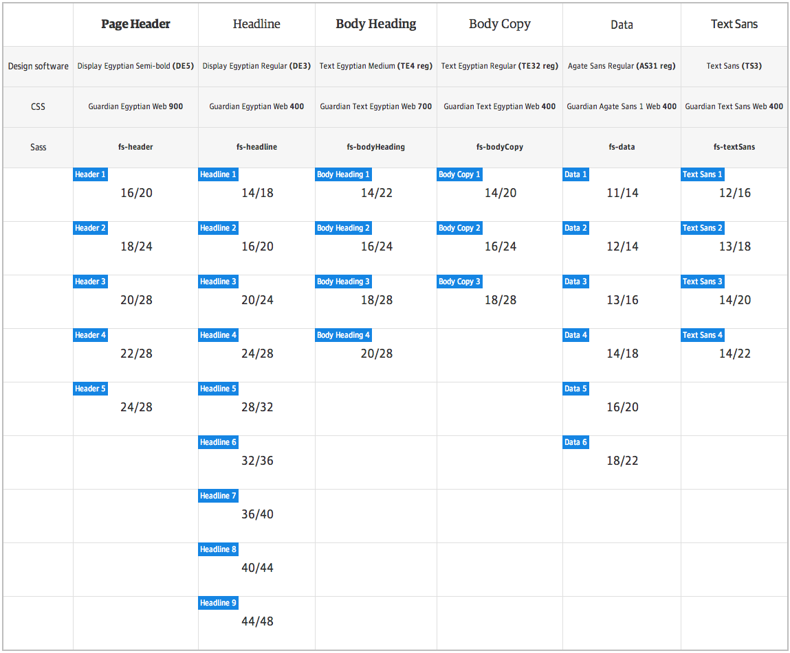

# Guss Typography

Part of the [Guss](https://github.com/guardian/guss) collection.

## Installation

```
bower install guss-typography --save
```

```scss
// Override defaults if needed
$sans-serif: "AgateSans", "Helvetica Neue", Helvetica, Arial, "Lucida Grande", sans-serif;
$serif: "EgyptianText", georgia, serif;
$serifheadline: "EgyptianHeadline", georgia, serif;
$text-sans: "TextSans", "Helvetica Neue", Helvetica, Arial, "Lucida Grande", sans-serif;
$headline-sans: "HeadlineSans", "Helvetica Neue", Helvetica, Arial, "Lucida Grande", sans-serif;

$fs-headers: (
    16 20, // 1
    18 24, // 2
    20 28, // 3
    22 28, // 4
    24 28  // 5
);

$fs-headlines: (
    16 20, // 1
    20 24, // 2
    24 28, // 3
    28 32, // 4
    32 36, // 5
    36 40, // 6
    40 44, // 7
    44 48  // 8
);

$fs-bodyHeadings: (
    14 22, // 1
    16 24, // 2
    18 28, // 3
    20 28  // 4
);

$fs-bodyCopy: (
    14 20, // 1
    14 22, // 2
    16 24, // 3
    18 28  // 4
);

$fs-data: (
    11 14, // 1
    12 14, // 2
    13 16, // 3
    14 18, // 4
    16 20, // 5
    18 22  // 6
);

$fs-textsans: (
    12 16, // 1
    13 18, // 2
    14 20, // 3
    14 22  // 4
);

@import "path/to/_helpers.scss";
@import "path/to/_font-scale.scss";
```

## Suggested default type settings

To kick start a project with scalable typography,
here are the suggested default global type settings:

```scss
html {
    font-family: $serif;
    // Make type rendering look crisper
    -moz-osx-font-smoothing: grayscale;
    -webkit-font-smoothing: antialiased;

    // Set baseline font size to 10px
    // This is used as a baseline for rem (root ems) values
    font-size: 62.5%;

    // For IE11 to do the math properly
    // See http://bit.ly/1g4X0bX — thanks @7studio and @dawitti
    font-size: calc(1em * .625);
}
body {
    color: $c-neutral1;
    font-size: 1.6em; // Bump font-size back up to 16px
    line-height: 1.5;
}
```

## Usage

Refer yourself to the matrix below, using these principles:

```scss
h1 {
    @include fs-headline(4);
}
p {
    @include fs-bodyCopy(3);
}
.small-text {
    // Output font-size and line-height only
    @include fs-bodyCopy(1, $size-only: true);
}
.body-heading {
    // Output font family and weight settings only
    @include f-bodyHeading;
}
```

## Features

Provides Sass mixins and values for the Guardian typography & font scale.



### Nota Bene

`HeadlineSans` is not currently integrated into our font scale, hence no `fs-` mixin; currently we're just using it as a replacement font in a few places.
