#Visual glossary of the Guardian.com

## Content Types

### Standard

[A standard article](http://m.code.dev-theguardian.com/law/2012/jul/27/twitter-joke-trial-high-court) consists of a [headline](http://m.code.dev-theguardian.com/football/blog/2012/may/10/signing-of-season-premier-league), standfirst, date, main image + caption, body copy, contributor/byline + image

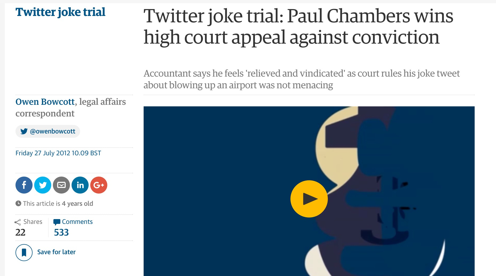

- [Embedded images, quotes](http://m.code.dev-theguardian.com/crosswords/crossword-blog/2012/jul/26/top-10-crosswords-fiction-olivers-travels)
- [Full width trail image](https://www.theguardian.com/travel/2016/aug/08/top-10-seawater-swimming-pools-in-europe)

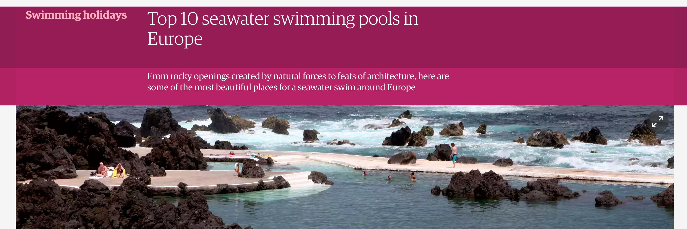

### Full page interactives

- [The Counted - Interactive map](http://www.theguardian.com/us-news/ng-interactive/2015/jun/01/the-counted-map-us-police-killings)

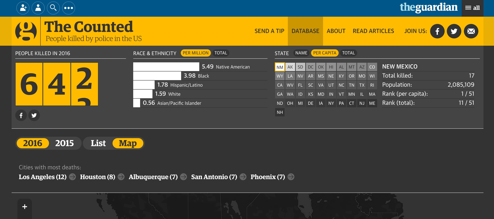

- [How Katie Ledecky obliterated her own world record in the 400m freestyle](http://www.theguardian.com/sport/ng-interactive/2016/aug/08/how-katie-ledecky-obliterated-her-own-world-record-in-the-400m-freestyle)

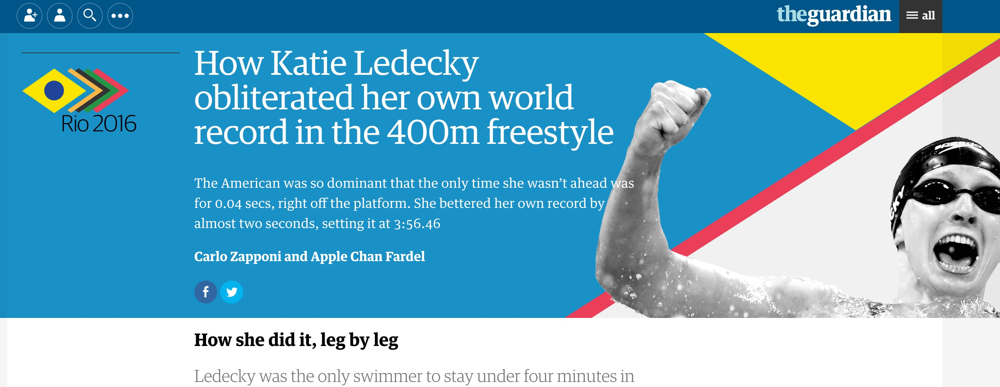

### Immersives

- [Full height images](https://www.theguardian.com/music/2015/nov/15/adele-25-new-album-interview)
- [Illustration heavy](https://www.theguardian.com/society/2016/apr/07/the-sugar-conspiracy-robert-lustig-john-yudkin)

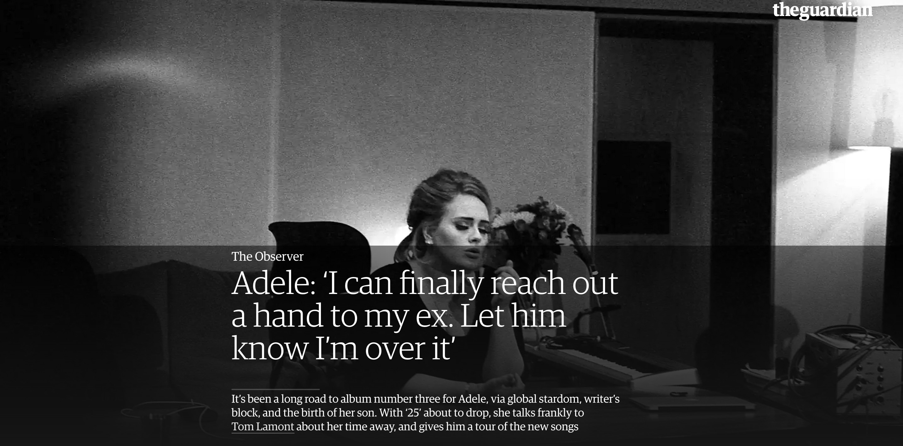

### Live Blogs

[Quick paced content, in liveblog 'blocks'](http://www.theguardian.com/politics/live/2016/jun/28/brexit-live-cameron-eu-leaders-brussels-corbyn-confidence)

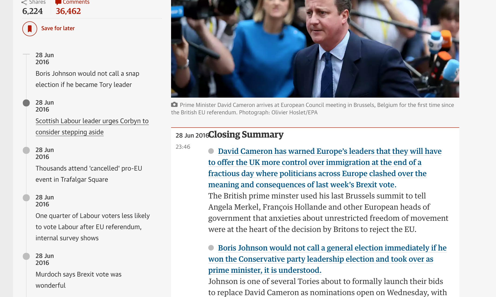

### The Minute

- [Unusal content layout, designed for reading in '1 minute'](https://www.theguardian.com/us-news/live/2016/jul/15/2016-official-pence-trump-announcement)

## Onwards

### More on - Story package

[Story package](http://m.code.dev-theguardian.com/lifeandstyle/2012/feb/01/top-five-regrets-of-the-dying)

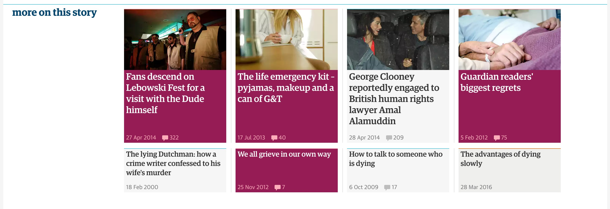

[Your next box set](http://m.code.dev-theguardian.com/tv-and-radio/2012/jul/26/john-adams-next-box-set)

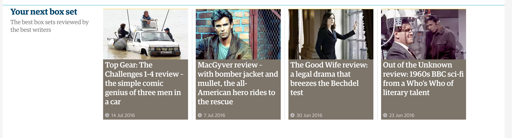

### Blog Series

[Blog Series](http://m.code.dev-theguardian.com/crosswords/crossword-blog/2012/jul/26/top-10-crosswords-fiction-olivers-travels)

### Related

[Related onwards content](http://m.code.dev-theguardian.com/sport/2012/jul/27/london-2012-team-gb-clark-lenzly)

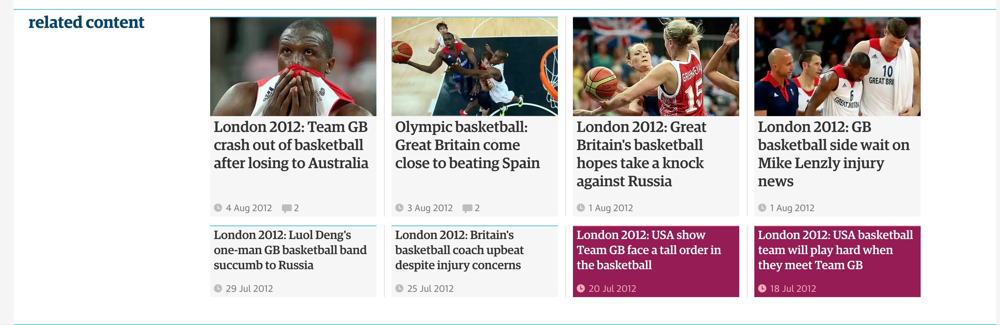

## Content Elements

### Block quote

- [Lots of quotes](http://m.code.dev-theguardian.com/stage/theatreblog/2012/jul/20/stage-reader-reviews-timon-of-athens)

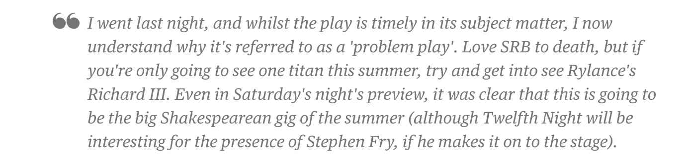

### Review stars

- http://m.code.dev-theguardian.com/music/2012/jul/26/olympic-torch-relay-finale-hyde-park

### Embedded video

- [Embedded video player](http://m.code.dev-theguardian.com/music/2012/jul/26/peter-gabriel-30-years-womad)

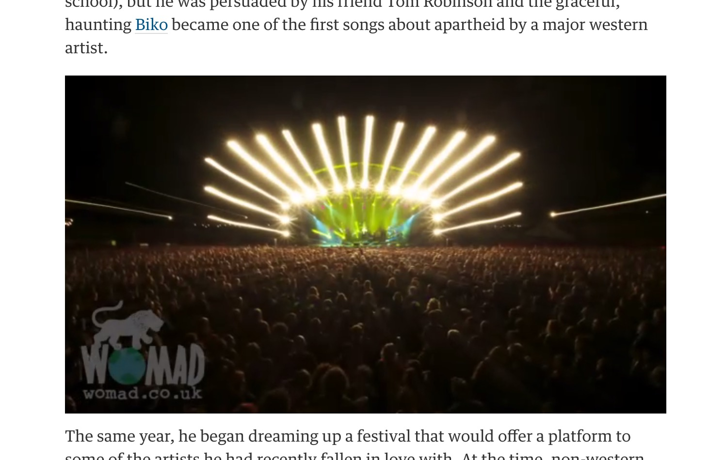

## Odd body formatting examples

- [Bold in standfirst](http://m.code.dev-theguardian.com/uk/2012/jul/26/ira-northern-ireland-dissident-republican-groups)
- [Image with unreadable text](http://m.code.dev-theguardian.com/sport/2012/jul/20/cricket)
- [Match Preview](http://m.code.dev-theguardian.com/football/2012/may/04/squad-sheets-wolverhampton-wanderers-everton)
- [The Fiver - Unsual heading formatting](http://m.code.dev-theguardian.com/football/2012/jul/26/the-fiver-team-gb-olympics)
- [A list post, lots of images](http://m.code.dev-theguardian.com/travel/2012/jul/23/50-free-things-to-do-london)
- [Footnotes with internal anchors](http://m.code.dev-theguardian.com/music/2012/jul/26/wallace-gromit-composer-concerto-proms)
