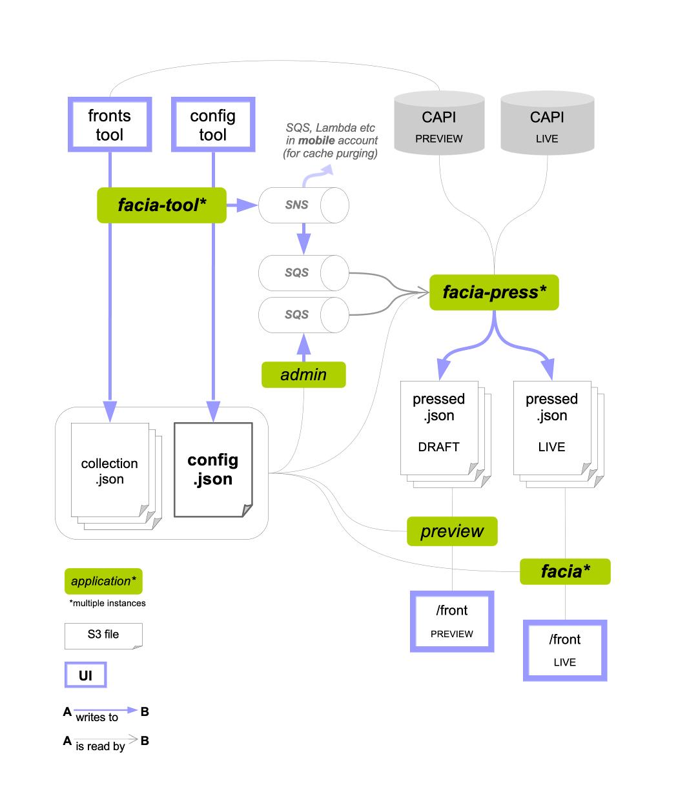

# Fronts architecture



Rendering a front requires fetching a lot of information from multiple sources (CAPI, Fronts config, Fronts collections). In order to avoid doing this gruelling work inline when a user request is received, all data necessary to render a front is prefetched and aggregated in a single location (S3).

In a nutshell:
- [Facia press](#facia-press): for each front, fetch all necessary data, aggregate it and store it in S3
- [Facia](#facia): read the aggregated data from S3 and render the front

## Facia Press
It is not a user facing service, it processes events published to queues.
There are 2 queues:
- one queue populated by a cron job running in the Admin app.
- one queue where the Fronts tool (fronts.gutools.co.uk) publishes events when a front is being updated.

The cron job is very important since content for a front can be coming from CAPI and change without any update from the Fronts tool.

The level of priority of a front will impact how often the cron job would request its update:
- Edition and sport fronts: High update frequency
- Other Editorial fronts: Standard update frequency
- Email fronts: Standard update frequency
- Commercial fronts: Low update frequency
- Training fronts: Low update frequency

### Pressing a front:
In reaction to a new event published to the queues described above, Facia-press will:

1. Get the collections that compose the front by fetching the Fronts config at `s3://facia-tool-store/STAGE/frontsapi/config/config.json` in the CMS Fronts account. This file is edited using the Configuration Tool. Ex: [Editorial Fronts Configuration Tool](https://fronts.gutools.co.uk/editorial/config)

Example of a front config:
```
...
"uk/business": {
    "collections": [
        "uk/business/regular-stories",
        "uk/business/feature-stories",
        "12554364-5a48-4e1a-a931-4dbcd144a12a",
        "98257c5b-f7af-4238-994e-edfb17e3b16e",
        "7aa73028-4e76-48d7-a44e-b62a15d36a65",
        "uk/business/most-viewed/regular-stories",
        "b5058768-e4a8-4e37-a61e-5f8e4df7f8fc"
    ],
    "webTitle": "Economy",
    "title": "Latest financial, market & economic news and analysis | Business",
    "description": "Latest financial, market &amp; economic news and analysis from The Guardian"
}
...
```

In the same file, here is an example of one collection config
```
"12554364-5a48-4e1a-a931-4dbcd144a12a": {
    "displayName": "multimedia",
    "type": "fixed/small/slow-I"
}
```
Note:
- A collection type corresponds to its layout.
- Facia-press is using the [Facia scala client](https://github.com/guardian/facia-scala-client) to interact with the data store in the CMS Fronts bucket. (No direct call to S3)

2. Get the curated stories/content for each collections of the fronts by fetching the collection data files at `s3://facia-tool-store/STAGE/frontsapi/collection/COLLECTION/ID/collection.json` in the CMS Fronts account. This file is edited using the Fronts Tool

Each collection will contain the `id` and `metadata` for all their running stories that have been curated by editors using the Fronts tool.
For each story, Facia-Press also fetches content details via CAPI.

3. Get backfilled content.

A collection can contain curated content (picked by editors using the Fronts tools) but can also be filled with stories coming from CAPI.  This can be configured using the Fronts tools.

4. Get treats content

A treat is a link that can be shown on the website in the bottom left corner of a collection container.

5. Get SEO and properties

This is an additional request to CAPI to fetch SEO and other metadata for the front page.

6. Finally aggregate all the data fetched in the previous steps and store the result in its json form in S3 (`s3://aws-frontend-store/STAGE/frontsapi/pressed/live/FRONTS/fapi/pressed.v2.json in Frontend account`)

Note:

Two versions of a fronts data are being pressed: Live and Draft
- __Draft__ corresponds to a front with all its latest modifications, even the ones that have not been "launched" yet. Editors can use [Preview](https://preview.gu-tools.com) to look at a "draft" front before they make their changes public.
- __Live__ corresponds to a front in its "launched" state. The one accessible on https://theguardian.com

## Facia

As mentioned above, when Facia receives a request for a front, it:

1. fetches the "pressed" data from S3 (`s3://aws-frontend-store/STAGE/frontsapi/pressed/live/FRONTS/fapi/pressed.v2.json in Frontend account`)

2. renders the front.

Each front collection would be rendered into a `container`. A container is always full-width.

The collection type (ex: `fixed/medium/slow-VI`) will decide the type and layout of the container. See [here](https://github.com/guardian/frontend/blob/main/common/app/layout/slices/FixedContainers.scala#L79) and [here](https://github.com/guardian/frontend/blob/main/common/app/layout/slices/Container.scala#L12)

Each container is composed of `slices` (aka "rows"). Each [Slice definition](https://github.com/guardian/frontend/blob/main/common/app/slices/Slice.scala) specifies columns info and css classname.

Each row contains cards.

A card displays the information of one story/content.

## Glossary:

Here are the definitions of a few words and expressions related to fronts:

_Snap_:
A way to include arbitrary content into a collection (rather than a story).
A snap can be a link (often used to show an interactive on the front) or dynamic content (latest story for given tag).

_Thrasher_:
A type of container that contains a single full-width element.

_Dynamo_:
A type of container often used to highlight a huge story. It's better known in the codebase as the `dynamic/package` collection type.

_Groups_:
A way to further tweak the layout of a collection. Dynamic collections can have multiple groups (standard/snaps or huge/veryBig/big/standard). Depending on the group a story/content is in, the layout of the container will be slightly altered.

## More

- [Facia Level Metrics & Alerts](facia/facia-monitoring.md)
