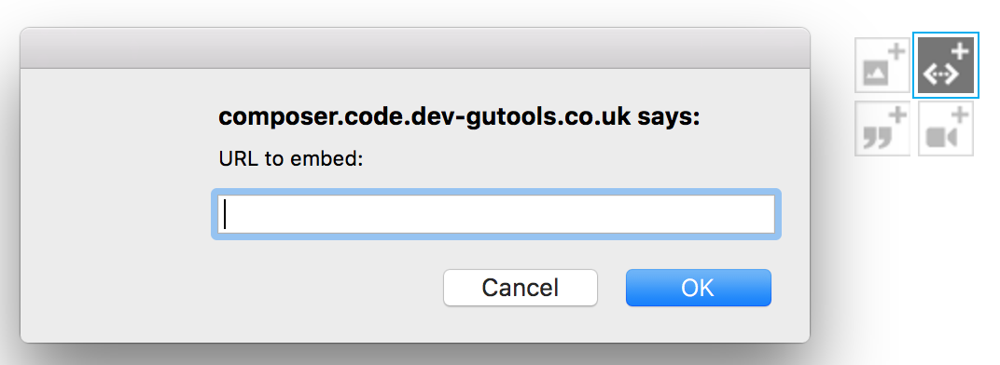

# Interactives

This document explains how to create interactive content on theguardian.com. Interactive content allows us to quickly develop creative
forms of content, such as [explainers](https://explainers.gutools.co.uk/), [bespoke media content](https://github.com/guardian/media-atom-maker)
and [immersive articles](https://www.theguardian.com/environment/ng-interactive/2015/nov/26/the-mekong-river-stories-from-the-heart-of-the-climate-crisis-interactive),
 without having to introduce code into `frontend`.

There are three strategies for creating interactive content:

- interactive content atoms
- interactive embeds
- interactive articles

## Interactive content atoms

Interactive content atoms are the recommended way to create interactive content going forward. They are treated as first
class citizens within the `frontend`. Their scripts are [inlined](https://github.com/guardian/frontend/blob/master/common/app/views/fragments/atoms/interactive.scala.html) rather than loaded by an external request,
therefore they contribute less to page yank.

Instructions for creating interactive content atoms can be found in the
[interactive-atom-maker](https://github.com/guardian/interactive-atom-maker) repo


## Interactive embed

An interactive embed is a HTML page that is injected into an article as an `iframe`, using a [standard boot
script](https://interactive.guim.co.uk/embed/iframe-wrapper/0.1/boot.js). The standard boot script provides event hooks that allow the
embed to communicate with the parent page.

The embed can be uploaded to S3 along with any associated assets such as styles, fonts and scripts.

Interactive embeds are likely to be replaced by interactive content atoms.

## Interactive article

An `iframe` embed does not provide enough flexibility to achieve certain effects. The interactive article
allows the entire article to be styled using a boot script, letting us create striking, immersive experiences.

An interactive script comprises a stand-alone javascript application wrapped in an AMD interface, which can be loaded and executed by
`frontend` code.

The interactive AMD module must return an object with a method called `boot`. What the interactive module does after this is largely up
to whoever is writing it.

This module can be uploaded to S3 along with its associated assets.

Here is a simple boilerplate using this pattern:

```
define(['your/dependencies'], function (dependency) {
    return {

        /**
         *
         * @param el        : The Element of the interactive that is being progressively enhanced.
         * @param context   : The DOM context this module must work within.
         * @param config    : The configuration object for this page.
         *
        **/

        // 'boot' is a standard interface for our application to start the interactive
        boot: function (el, context, config) {

                // do something to bootstrap the interactive

            }
        }
    });
```

## Embedding the interactive in an article

When an article is created in Composer, a URL is assigned and an editor can publish it. At this point,
the page content will appear in the Content API.

When the page is delivered to the user the frontend code scans the DOM for interactives and loads each one.

Interactives can be added to an article in Composer using the embed link:



- for **interactive boot scripts**, enter the URL of the boot script
- for **interactive embeds**, enter the URL of the embed HTML
- for **interactive content atoms** enter the CAPI URL for the content atom

## Examples

- Interactive article with interactive boot script: [Mekong: a river
rising](https://www.theguardian.com/environment/ng-interactive/2015/nov/26/the-mekong-river-stories-from-the-heart-of-the-climate-crisis-interactive)
- Interactive embed: [Who can vote and
how](https://www.theguardian.com/politics/2016/apr/28/british-expats-lose-legal-battle-right-to-vote-eu-referendum)
- Interactive content atom

Note how, in your web inspector network panel, the `boot.js` file is loaded and subsequently loads the interactive application.

## Service workers

Service worker JavaScript files can be loaded within interactives.

A URL like:

https://www.theguardian.com/society/2016/oct/24/many-treatments-give-no-more-benefit-than-doing-nothing-leading-doctors

can load a service worker from:

https://www.theguardian.com/society/2016/oct/24/many-treatments-give-no-more-benefit-than-doing-nothing-leading-doctors/interactive-service-worker.js?timestamp=1234

This URL then proxies a request to:

https://interactive.guim.co.uk/service-workers/live|preview/society/2016/oct/24/many-treatments-give-no-more-benefit-than-doing-nothing-leading-doctors/1234/interactive-service-worker.js

depending on the environment you are viewing in.

## Notes

- Frontend currently use [curl.js](https://github.com/cujojs/curl) to load AMD modules.
- Interactives can be hosted on s3://gdn-cdn, which is mapped to [interactive.guim.co.uk](http://interactive.guim.co.uk).
- s3 [supports CORS](http://docs.aws.amazon.com/AmazonS3/latest/dev/cors.html).
