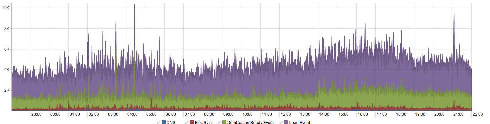

# Level 3 lack of gzip support

- date: Starting about 2pm, 12 March 
- duration: 4 hours
- environment: PROD 

## Summary

The Guardian are moving off Akamai to L3. At 2pm, 12 March the switch was made.

Later that afternoon @ahume spotted that the 'Content-Encoding: gzip' header was missing from the mDot response headers and on further inspection
noticed none of the assets were being gzipped.

This has the consequence of massively inflating our page size and slowing down the perceived speed of our website to our audience, especially those on
slower connections.

Further to this the Omniture, Ophan, Advert and cookie clean up code is deferered to the onLoad event, so this problem would have the effect of seeing the
initialisation code for these functions delayed.

During next reasonable office hours (10am, 13 March) WebSys rolled back to Akamai.

## Resolution

- WebSys (Diego) rolled-back asset serving to Akamai & liaised with L3
- L3 now correctly support gzip encoding.

## Analysis

On inspecting the Ophan performance graphs a noticable jump of 50-75% in the DomContentReady metric (green) can be seen shortly after 2pm, a likewise a jump
in the Load event. Both these indicators corresponded with the observation that assets are much larger than they were before 2pm. 

We believe the increase in DomContentReady was caused by the 50kb (inflated to 250kb without gzip) CSS file blocking the DomContentReady event in some (if not all) browsers.

We believe the increase in the Load event times was cause by the large increase in total overall payload required to complete the page download.

## Thoughts

- @ahume spotted the problem. The team were not paying that much attention to what was actually quite a big infrastructural change.
- GZIP is quite fundamental to our performance. It is a feature, so it should be tested.
- Architectually it would help if all sites did gzipping in the same way - I.e. "it's a CDN problem", or "it's a nginx problem"

## Actions

- Write some integration tests for correct gzip/vary headers.
- Investigate alerting / ganglia integration for the web performance ophan data.
- Look at optimisation of CSS - see: https://github.com/guardian/frontend/issues/531

