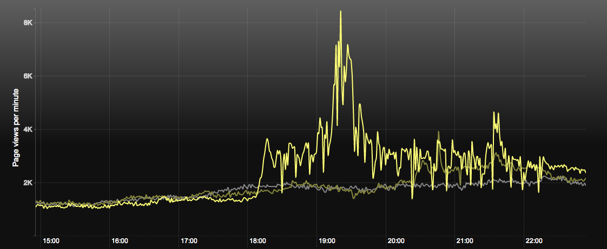
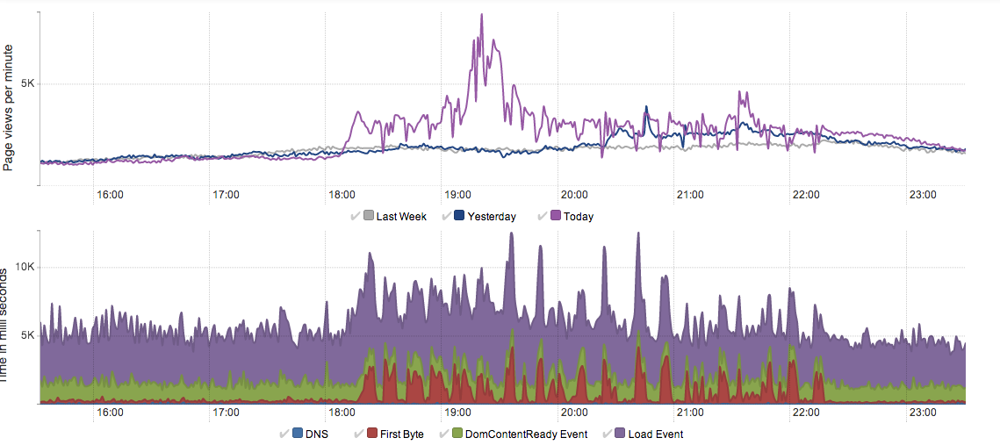

# Article server

- date: Starting 6pm 2013-03-13
- duration: Until 10.30pm
- environment: PROD

## Summary

A massive traffic spike coinciding with the Papal election announcement degraded
the ability of Frontend Article servers to handle the load. (Habemus Server
Incendia!)

Article servers began failing system healthchecks at 6.27pm and cycling at the
rate of one termination approximately every five minutes.

Gomez reported four transient Severe Response Time Failures on the five minute
schedule at 6.59pm, 8.54pm, 9.50pm and 10.04pm.

Ophan mobile graph view exhibited elevated time to first byte spikes on a
recurrent basis which we associate with cycling EC2 instances.

The GuardianOps dashboard for Frontend indicated the number of 200s served fell
dramatically at 6.30pm and remained low. The number of 404s and other codes
rose significantly at the same time. This 200 suppression behaviour is
consistent with high load and represents loss of revenue for the organisation
during a time of request abundance.

The Gomezs emails and AWS emails were noticed by chance at 9.30pm. It was
quickly recognised that the article servers were cycling and an email was sent
on the group mailing list.

The responding developer did not have VPN available and made the call to
return to the office and diagnose/remedy the issue.

In the meantime, Graham and team members diagnosed the time to first byte errors
in Ophan, and found elevated levels of "java.io.IOException: Too many open
files" exceptions on calls to the Content API.

This problem indicates resource contention on the article server boxes looking
for file handles to process the elevated number of requests being handled. For
verification, the Content API dashboard was checked and as expected was handling
the load gracefully.

At this point the solution strategy was identified --- increase the capacity to
serve by adding new article server instances thereby reducing load on each
individual server to a level where file handle resource contention was not an
issue.

The developer arrived at his desk at 10.10pm and initiated a four fold scale out
from two instances to eight. In response to suggestions, the cache times on
pages were doubled by using the admin switch. This is a standard action in
response to high load.

The response time doubling was verified client side.

By 10.20pm, seven of the eight article servers were in service and no problems
were observed with time to first byte figures in the Ophan dashboard. The final
server followed into service and the system achieved steady state.

The system was monitored until 11.30pm during which no first byte spikes were
observed. In addition, the rate of 200s served returned to the expected rate and
non 200s declined.

# Graphs

Page views p/min arriving at mDot,

Web Performance API from Ophan,

The red peaks in the second graph indicate slow connection problems between the user and guardian.co.uk

This corresponds with the periodic sharp drops in the first graph, which is the requests p/minute being made to us.

## Actions

Mostly this was bad timing. There is small comfort in that the Papal
announcement was probably far worse timing for the newspaper.

* We still need to do better on alerting. There should be a group email on out
  of hours AWS autoscale events.
* We don't trust Gomez and the tendency is to just ignore it. This is death for
  a monitoring system. Possibly reconsider the Pingdom subscription.
* Faciliate VPN access from personal laptops. This would have reduced the time
  to fix by abou 15-25 minutes.
* Drill on noticing traffic spikes and proactively responding. Fix this scenario
  until it works perfectly.
