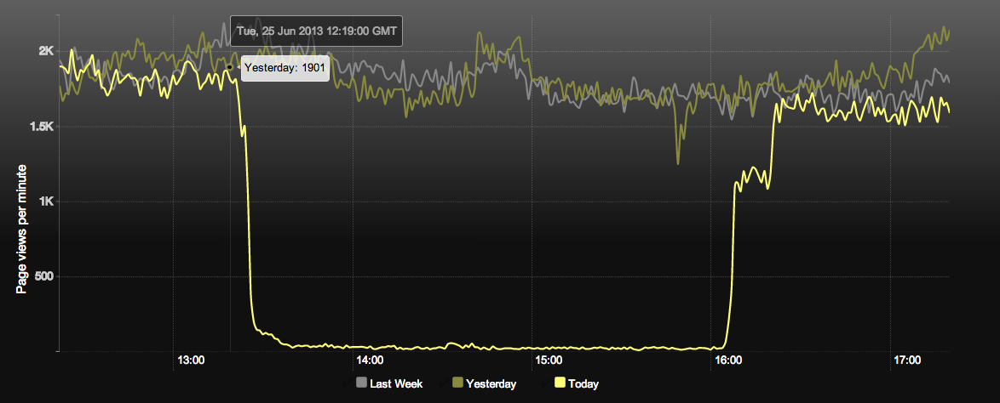
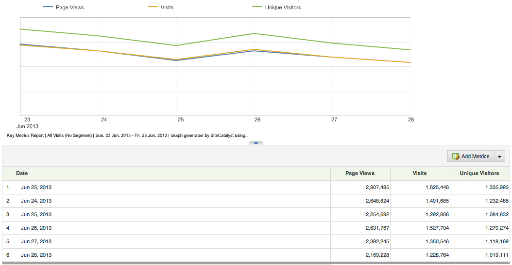

# Deploying a broken AB test

- date: First reported about 2pm
- duration: 2.5 hours
- environment: PROD

## Summary

A change to the AB testing JavaScript module caused dependent code to call an non-existant method.

The JavaScript application stopped working - meaning everything from features, stats, adverts failed. Importantly though, the core product (fronts,
articles etc.) remained accessible.

## Cause

On Friday 21 June @ironsidevsquincy made a pull request to master for some improvements to the AB testing framework.

On Tuesday 25 June this was merged to master by @phamann. @ironsidevsquincy was on vacation this day.

Several other merges to master were made that morning.

Due to the GC2 move and subsequent breaking of the deployment process the releases were stacked up on top of each other.

Likewise, the GC2 move broke all the Graphite graphs, giving the developers reduced visibility of production.

At approx 1:15pm @commuterjoy released these changes to PROD, only checking the merge that he made and giving a cursory glance at the rest of the
application.

At 2pm we were notified that the Ophan graphs had dropped off.

Inspection of the JavaScript logs by @daithi indicated a error with the common bootstrap calling a recently deleted method in the AB testing module.

@phamann and @commuterjoy fixed the code and release it 4pm. The graphs recovered shortly after.

## Consequences

A few Tweets indicated people noticed the degraded state (less images than normal).

We lost the record of approximately 14% of our page views for the day.

## Thoughts

Releasing several things at once should be the exception, and typically is. It makes identification of the cause of problems harder and make the
person releasing responsible for checking changes that they did not make. Perhaps when deploys are blocked we should restrict merges to master?

Progressive enhancement wins here. People could still use the site perfectly well.

This shows how brittle a JavaScript application is. A single error can cause everything to break.

## Actions

- We need Ophan on a dashboard somewhere visible to the team.
- We have a growing amount of code in the controllers. We should increase the number of integration tests around this and/or move some in to modules.
- Discuss JavaScript architecture - is there anything we can do to prevent errors?

