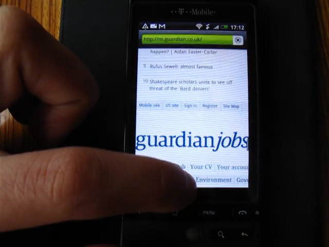

# Jobs advert iframe 

- date: First reported 11:13am - 30 March 2013
- duration: Fixed around 11am 1 April (~48 hours) 
- environment: PROD

## Summary

Seb Cevey reported the jobs.guardian.co.uk being embedded in the page to @patrickhamann & @commuterjoy via Twitter,

    "Looks like the GuardianJobs desktop homepage gets iframed into the bottom of m. article pages (!). Ad gone mad?"

During the afternoon various people on the frontend team confirmed this.

On closer inspection a mangled advert was embedding the [jobs site](http://jobs.guardian.co.uk/) in to an iframe in place of the mDot advert slots.

The advert was targetted at both both top and bottom slots, often appearing twice.

## Impact 

This incident had some user facing consequences.

On most phones (iPhone & later Androids) users saw the jobs site 'cookie opt-in' message displayed in the ad slot, at other times portions of the navigation toolbar. On these phones the user impact was probably minimal, at most, mild confusion and the appearance of the site site loading taking longer than usual.

On other phones the iframe had no height boundary so the full jobs page was embedded on the screen (at least Android 2.x / HTC -- TODO confirm). On
these phones the Guardian site would have be less accessible, especially if the advert occupied the top slot.

The jobs site made approximately ~80 additional HTTP requests and downloaded ~400kb of extra data including adverts, and tracking code etc.

The jobs site was not designed to run in an iframe a threw ~250 console error messages.

This had the consequence of increasing the hourly average traffic to jobs by ~9900% (!)

## Cause

From Rez,

"One of the 3rd party ad tags (Admeld) is/was the problem. The reason it was 'fixed' over the weekend was
that the Admeld tags all completed at the end of March. As Easter Monday was the 1st April - the problem went away, because Admeld was no longer
serving that day. Ad tags tend to get sent up in bursts of activity. These ones were running for 3 months and finished at the end of March

I just set up the last creative from the Admeld creatives (from last week) on a test cookie page - and can see the problem is still there.

I am speaking to AdOps to ensure they talk to Admeld so they can see the issue on the test cookie page - and confirm they have fixed it - before we
set live any new campaigns for them. Apparently AdOps had provided Admeld a Jobs filler banner (if they had no creative to serve). It feels like they
have made an error somehow and are pulling in the jobsite, instead of a simple filler banner."

## Resolution

- 30 March 2013 12:28 - Matt C mailed Rezal Haque, requesting the advert be switched off.
- 30 March 2013 18:01 - Matt C emailed WebSys after no response.
- 30 March 2013 19:21 - Simon Huggins forwarded mail to <guardian.adops@guardian.co.uk>.
- 1 April 2013 11:00 - We observed someone had fixed the advert that morning
- 2 April 2013 15:00 - Ad Ops confirm a 'third party advert problem'

## Thoughts

- We need to address Ad Ops QA procedures. This is the second user-facing problem this week.
- 48 hours is not a good turn around time for a 2 minute fix.
- Frontend had no way of disabling individual adverts.

## Actions

- Make sure everyone knows 'guardian adops' email exists & is the place to report advert problems.
- Likewise, make sure we know about escalation procedures for adverts.
