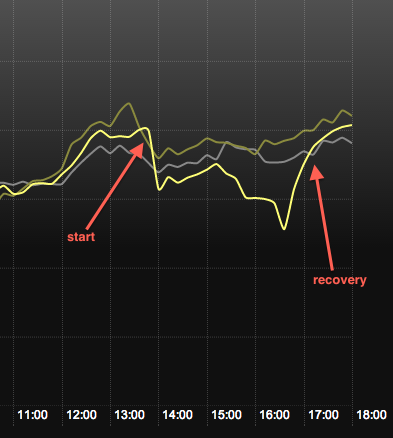

# Prolonged Content API outage 

- date: 2013-08-28
- duration: 1:45pm to 4:45pm (~3 hours)
- environment: PROD

## Summary

An [change](https://sites.google.com/a/guardian.co.uk/digital-incident-management/) to the Content API infrastructure resulted in an afternoon of instability for frontend.

We doubled cache times and disabled 'related links' and auto-refresh features to ease up on backend traffic.

## User-facing consequences

- Approximately 25% drop in traffic for the duration of the outage, largely articles.
- Deployments to production were blocked all afternoon.

# Graphs

Page views p/min arriving at mDot, 

# Thoughts

- The dashboard (radiator) and alerting felt useful during this time. I received a single Pager Duty call and Pingdom bounces all afternoon.
- The communication between Content API and WebSys appears poor. DevOps should improve that. 
- This reaffirms our reliance on a stable backend. Over the last month or so most of the downtime has been caused by an API outage of some description. 
- The roll out of a new & improved API is happening during our gradual ramping up of traffic on frontend, which presents a risk for us.

# Actions 

- Talk (again) about how to decouple the bulk of our requests from the API stability. Meeting set-up for mid-September.
