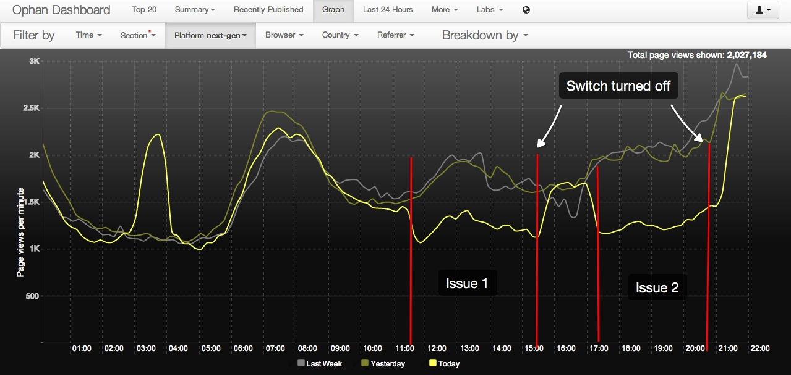

# Frontend incident report - 04/09/2013

## Date
4th September 2013 from 11:30 - 20:43

## Summary
At 11:30 a defect inside an update to the JavaScript application deployed across all servers caused a runtime error for ~25% of users. This error in turn caused other parts of the application to initiate including our analytics tracking.

The change was an enhancement to the expandable most popular A/B experiment launched the previous day based on received feedback. Specifically to hide trail text and images from story packages only if you are inside the experiment variant. Due to the way related content is lazy loaded if no curated package is available I had to disable the default behaviour and manage in side the test JS. The resulting code caused two issues, both of which were simple programming mistakes and should have been caught through testing and review processes.

1. 11:30 -> 15:30
The code assumed certain markup was present, and did not defend against the possibility of trail images not being present. Wrapping the block in a conditional fixed this.

Between the two issues PH attempted to fix the issue and re-deployed a hot-fix to all servers, turning the feature switch back on at 17:30. 

2. 17:30 -> 20:40
The code to remove elements from the DOM used a partially supported native JS method ```remove();``` this is not supported in Safari browsers and was throwing an exception. ```Element.parentNode.removeChild(Element);``` is much safer and supported globally.

Each time an issue was noticed – due a visible drop off in Ophan  – the feature switch was turned off for the A/B test and recorded traffic instantly stabilised. An email was then sent to the Frontend team and editorial contacts to inform.
MC and KP noticed features on the site were not functioning correctly over an email thread at 20:30 and made the final decision to turn the feature off permanently until resolved.

## Effect on end users
This only had a noticeable effect to ~15-25% of users due to A/B bucketing and only occurring on articles with non-curated story packages. All core content and servers were still accessible. Though users would not be able to see secondary content managed via JavaScript such as most popular component and comments.



## Lessons to be learned.
As the JS application does not stop pages from rendering or server errors, both instances took up to 45minutes until the runtime error was noticed. Visible drop off in Ophan proved to be most valuable. Significant drops in page views over a period of time should be alerted upon to allow further investigation. 

Javascript should never assume certain markup within the DOM and developers should always check for existence of an object before using.

Although we have a modular JavaScript architecture, runtime errors can still prevent the rest of the application from continuing to process. We should consider defensive patterns whereby modules can run in sandboxes without breaking other parts of the application.

I should always cross-browser test hot fixes, however urgent they are. 

## Actions
- Add Ophan page views to frontend radiator dashboard.
- Create alerts for significant drops in page views.
- Research sandboxing design patterns in large-scale JavaScript applications, and suggest architectural changes to prevent runtime errors.
