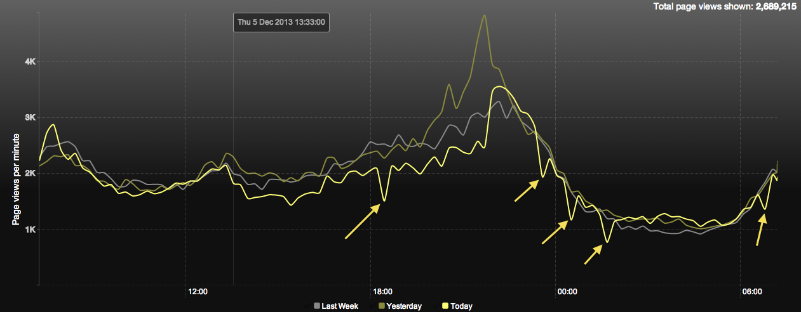
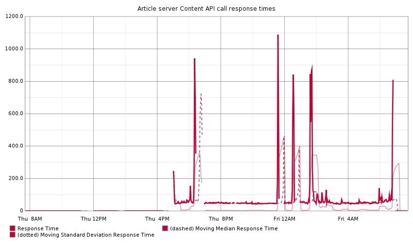

# Overnight traffic spike

- Start: 6:25pm, 5 December 2013
- duration: 12 hours, in five short bursts throughout the night 
- environment: PROD

## Summary

On the morning of 6 December we observed five short drops in traffic over the previous night.

Unlike [the 22 November incident](2013-11-22.md), the API made a recovery within a short period of time and remained servicable throughout the night.

## Resolution

Revert back to Content API V1 until diangosis.

## User-facing consequences

An approximate 30% drop in traffic was observed on the Ophan dashboards throughout the duration of the incident.

## Thoughts

-  

## Actions

-  
