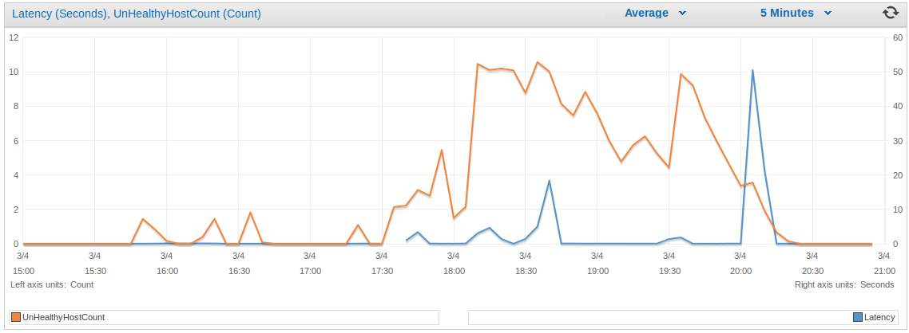

# Facia Borked

### Summary

On the 4th March at around 5pm, Facia was failing to pass any of its health checks on CODE, but was passing health checks on PROD and then subsequently dying and then constantly cycling.
It seemed to be a few unfortunate events:

 - The Content API Client had been bumped from 2.7 to 2.9
 - Teamcity was packaging the jars with the wrong version of the Content API client (2.7)
 - Serving of pressed pages had been turned on in CODE

Once the code for the pressed fronts was executed, which was always on CODE and only when an editor hit the special endpoint in PROD, the JVM on the box would completely exit.

### More Technical

A method in the content api client had changed it's signature from 10 parameters to 11, and the call to the Content API client was calling the method with 11 parameters, but the method with 10 was the one packaged. This meant that the called method (of 11) completely didn't exist and the JVM fell over.

The CODE deploy was failing after 5pm, but everyone continued to deploy to PROD anyway.
The bad build number from Teamcity was 3828.

### Impact

There was no noticable impact to users. Facia first just cycled on 3 boxes when they became unhealthy, and then started to scale up to 12 boxes due to the latency alarm. The endpoint that took down a box was being infrequently hit. Fastly would have continued to serve stale at the point the 3 boxes were scaling from 3 to 12.

### Thoughts

We need to check the deploys to CODE are OK before doing anything to PROD, as they were clearly failing. It seemed that nobody was watching what was really happening on CODE. And there was a full deploy to PROD carried out without any consideration to what was happening on CODE.
It was a pretty weird error, and if pressed was not switched on in CODE it would have passed and then failed. Health checks will catch this in the future when we switch over to pressed.

It also didn't help that it was late in the evening and everyone was wanting to merge their things.

### Actions

 - Babysit all your deploys
 - Look at how things are going on in CODE before doing a full deploy
 - Investigate the sbt assembly plugin issue, find a repro, workaround or fix. 

## ELB Metrics

### Unhealthy Boxes vs Healthy Boxes - Facia

### Unhealthy Boxes vs Box Latency-  Facia

