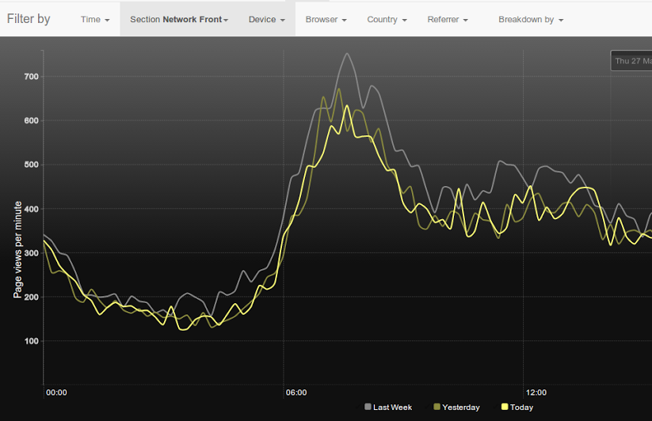

# ContentApi errors broke NG fronts

### Summary

Over the night of 25/26, and afternoon of 28th March 2013, NGW fronts intermittently stopped updating following edits in the fronts tool. The tool itself intermittently showed entire collections as consisting of unavailable content. The reason was:
* ContentApi was intermittently returning data with missing fields
* Pressed fronts were thus dropping whole collections, or just not updating

### More Technical

The content object from ContentApi has a "fields" property, itself and object containing "headline", "shortUrl", etc.
The "fields" property was missing in a percentage of requests - apparently those served from
a misbehaving instance within ContentApi's autoscaling group. Redeploying the ContentApi stack seemed to fix the problem.
However the root cause for the missing "fields" property remains unknown.

The pressing logic in Facia Tool abandons a pressing job (i.e. a page update) if a single content item is invalid,
i.e. is missing certain properties such as "headline" from the "fields" object.
This scenario has not been encountered previously; the integrity of ContentApi objects is largely assumed across the Frontent project. 

We deployed a fix to change this behaviour, so that pressing continues even if an individual item is invalid. Previously, the only case in which pressing would continue was when content 404'd.

### User facing consequences

Fronts were regularly failing to update. Certain collections - notably those that consist solely of
a ContentApi backfill such as the first container on /uk - were disappearing and reappearing randomly,
as the periodic re-pressing of them (every 5 minutes) was receiving either good or bad results from ContentApi.

The fronts tool also relies on ContentApi for its UI, so was randomly showing entire collections as broken.
The tool loads entire collections in one request, so was occasionally receiving batches of consistently broken content from the deficient ContentApi instance.

### Monitoring

The pressed success/failure counts on  `{instance hostname}:18080/management/status` at approx 10:30am on 27/03/2014 show approximately 10% of presses failing:

```
...
{
  "group": "facia-front-press",
  "name": "facia-front-press-success",
  "type": "counter",
  "title": "Facia front press success count",
  "description": "Number of times facia-tool has successfully pressed",
  "count": "9386"
},
{
 "group": "facia-front-press",
 "name": "facia-front-press-failure",
 "type": "counter",
 "title": "Facia front press failue count",
 "description": "Number of times facia-tool has has a failure in pressing",
 "count": "1014"
},
...
```

Logged [invalid content exceptions](https://console.aws.amazon.com/cloudwatch/home?region=eu-west-1#metrics:graph=!D03!D15!E08!E19!ET4!MN7!NS2!PD1!SS6!ST0!VA-P7D~900~Application~ApplicationName~P0D~Stage~Sum~content-api-invalid-content-exceptions~frontend-facia-tool~prod) from Facia show spikes at the relevant times:


Ophan PVs for the NGW network front do not appear to show any significant change in behaviour (graph period is approximately the whole affected period.)



### Thoughts

 - The "fix" needs reconsideration, as it weakens the defense against a completely broken ContentApi, i.e. fronts will potentially be pressed as empty if all (rather than individual) content objects are momentarily invalid. 

### Actions

 - A github page for status announcements.
 - More verbose logging of content validation errors during pressing.
 - Logging of content validation errors within the tool.
 
