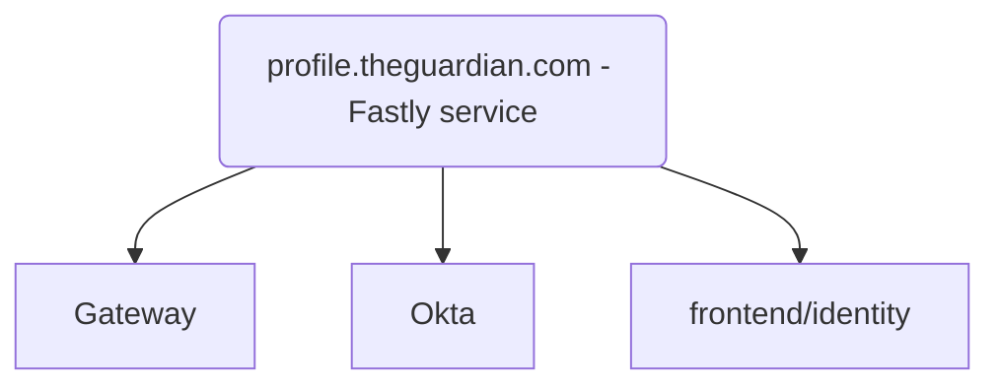

# Identity

This sub-project used to handle some of the Guardian [profile.theguardian.com](https://profile.theguardian.com/signin?) functionality
along with the now archived [guardian/identity-frontend](https://github.com/guardian/identity-frontend/).
The split over two projects was a cause of confusion and happened as part of an incomplete migration.

Functionality previously handled by this sub-project has moved over to [gateway](https://github.com/guardian/gateway)
which is the frontend to sign-in and registration at Guardian profile
and [manage-frontend](https://github.com/guardian/manage-frontend), the repo behind [manage.theguardian.com](https://manage.theguardian.com/)
(the 'Manage My Account'/MMA area for The Guardian).

However, this project is still:
* Serving the [healthcheck](https://github.com/guardian/frontend/blob/1af7982d4c426ce3f682d63985f15dfe76c3d68a/identity/conf/routes#L4): https://profile.theguardian.com/_healthcheck
* Serving the [Comments & Replies page](https://github.com/guardian/frontend/blob/1af7982d4c426ce3f682d63985f15dfe76c3d68a/identity/conf/routes#L14), e.g. https://profile.theguardian.com/user/id/16290152   
 
* Redirecting to [Manage My Account](https://github.com/guardian/frontend/blob/167fd995fd4fe3e6fb0a09250cbcd95d02699198/identity/conf/routes#L36) for certain functionality

## Architecture
This service receives traffic from the profile.theguardian.com Fastly service and it is one of its three backends,
the other two being Okta and Gateway.

Here's the VCL that sends traffic to identity for [CODE](https://github.com/guardian/identity-platform/blob/f36c9e49dcc0dbc071cecb7d9d68a6e77e483b1d/fastly/profile.code.dev-theguardian-com.vcl#L504) and [PROD](https://github.com/guardian/identity-platform/blob/f36c9e49dcc0dbc071cecb7d9d68a6e77e483b1d/fastly/profile-theguardian-com.vcl#L510).
