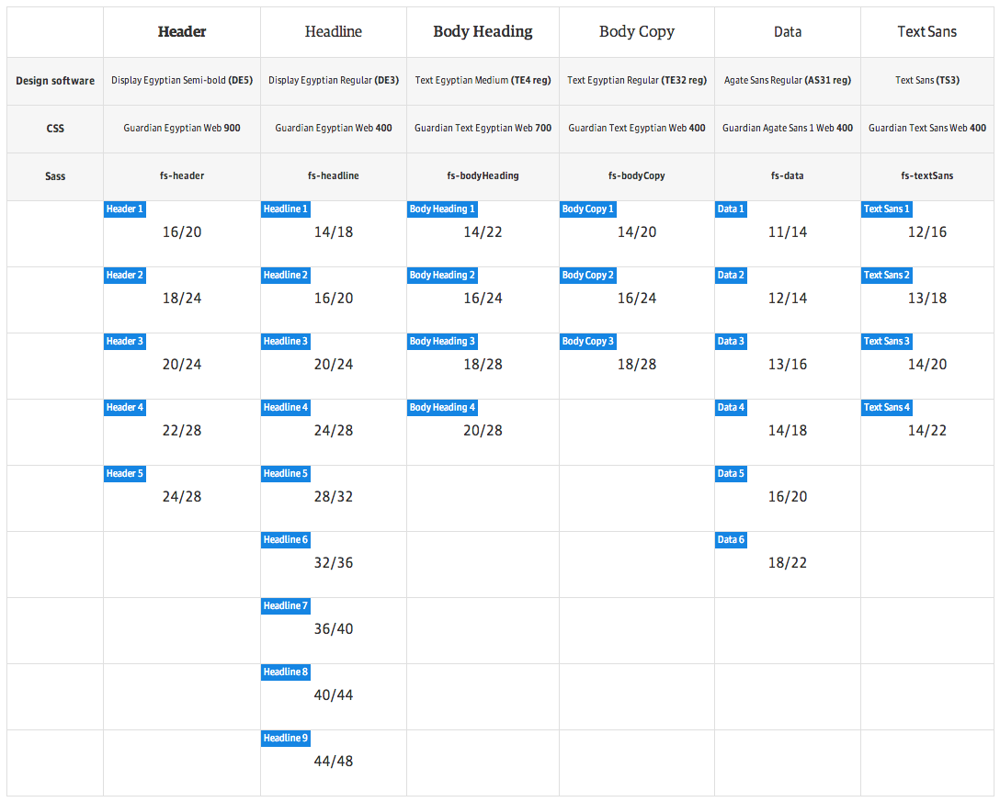

# Guss Typography

Part of the [Guss](https://github.com/guardian/guss) collection.

## Installation

```
bower install guss-typography --save
```

```scss
// Override defaults if needed
$f-data: 'Guardian Agate Sans 1 Web', 'Helvetica Neue', Helvetica, Arial, 'Lucida Grande', sans-serif;
$f-serif-text: 'Guardian Text Egyptian Web', Georgia, serif;
$f-serif-headline: 'Guardian Egyptian Web', Georgia, serif;
$f-sans-serif-text: 'Guardian Text Sans Web', 'Helvetica Neue', Helvetica, Arial, 'Lucida Grande', sans-serif;
$f-sans-serif-headline: 'Guardian Sans Web', 'Helvetica Neue', Helvetica, Arial, 'Lucida Grande', sans-serif;

$font-scale: (
    header: (
        1: (font-size: 16, line-height: 20),
        2: (font-size: 18, line-height: 24),
        3: (font-size: 20, line-height: 24),
        4: (font-size: 22, line-height: 28),
        5: (font-size: 24, line-height: 28),
    ),
    headline: (
        1: (font-size: 14, line-height: 18),
        2: (font-size: 16, line-height: 20),
        3: (font-size: 20, line-height: 24),
        4: (font-size: 24, line-height: 28),
        5: (font-size: 28, line-height: 32),
        6: (font-size: 32, line-height: 36),
        7: (font-size: 36, line-height: 40),
        8: (font-size: 40, line-height: 44),
        9: (font-size: 44, line-height: 48),
    ),
    bodyHeading: (
        1: (font-size: 14, line-height: 22),
        2: (font-size: 16, line-height: 24),
        3: (font-size: 18, line-height: 28),
        4: (font-size: 20, line-height: 28),
    ),
    bodyCopy: (
        1: (font-size: 14, line-height: 20),
        2: (font-size: 16, line-height: 24),
        3: (font-size: 18, line-height: 28),
    ),
    data: (
        1: (font-size: 11, line-height: 14),
        2: (font-size: 12, line-height: 14),
        3: (font-size: 13, line-height: 16),
        4: (font-size: 14, line-height: 18),
        5: (font-size: 16, line-height: 20),
        6: (font-size: 18, line-height: 22),
    ),
    textSans: (
        1: (font-size: 12, line-height: 16),
        2: (font-size: 13, line-height: 18),
        3: (font-size: 14, line-height: 20),
        4: (font-size: 14, line-height: 22),
    )
);

@import 'path/to/_typography.scss';
```

## Suggested default type settings

To kick start a project with scalable typography,
here are the suggested default global type settings:

```scss
@include guss-typography-defaults;
```

Compiles to:

```css
html {
    font-family: "Guardian Text Egyptian Web", Georgia, serif;
    -moz-osx-font-smoothing: grayscale;
    -webkit-font-smoothing: antialiased;
}
body {
    line-height: 1.5;
}
```

## Usage

Refer yourself to the matrix below, using these principles:

```scss
h1 {
    @include fs-headline(4);
}
p {
    @include fs-bodyCopy(3);
}
.small-text {
    // Output font-size and line-height only
    @include fs-bodyCopy(1, $size-only: true);
}
.body-heading {
    // Output font family and weight settings only
    @include f-bodyHeading;
}
.get-font-size {
    font-size: get-font-size(headline, 6);
}
.get-line-height {
    line-height: get-line-height(header, 3);
}
```

## Features

Provides Sass mixins and values for the Guardian typography & font scale.



### Nota Bene

`Guardian Sans Web` is not currently integrated into our font scale matrix, hence no `fs-` mixin; currently we're just using it as a replacement font in a few places.
