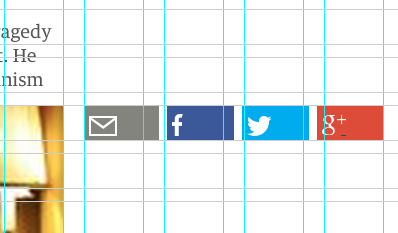

## Gridlet



The gridlet bookmarklet overlays the NextGen grid over the current page. It can be dragged around and can also be controlled by keyboard.

- **G**: Hide/Show grid 
- **D**: Desaturate content area
- **Arrow keys**: precise positioning 

Copy the code below to the bookmarks bar:
```
javascript:javascript:(function()%7Bdocument.body.appendChild(document.createElement('script')).src='https://rawgithub.com/guardian/frontend/grid-bookmarklet/tools/grid-bookmarklet/grid.js?'+(new Date()).getTime();%7D)();
```
